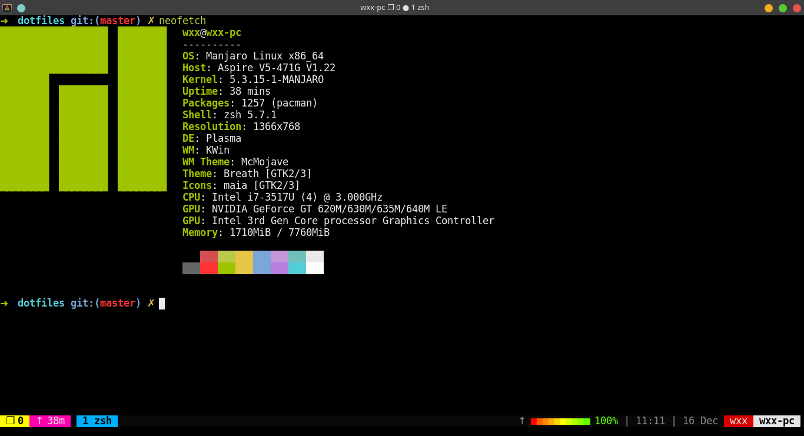
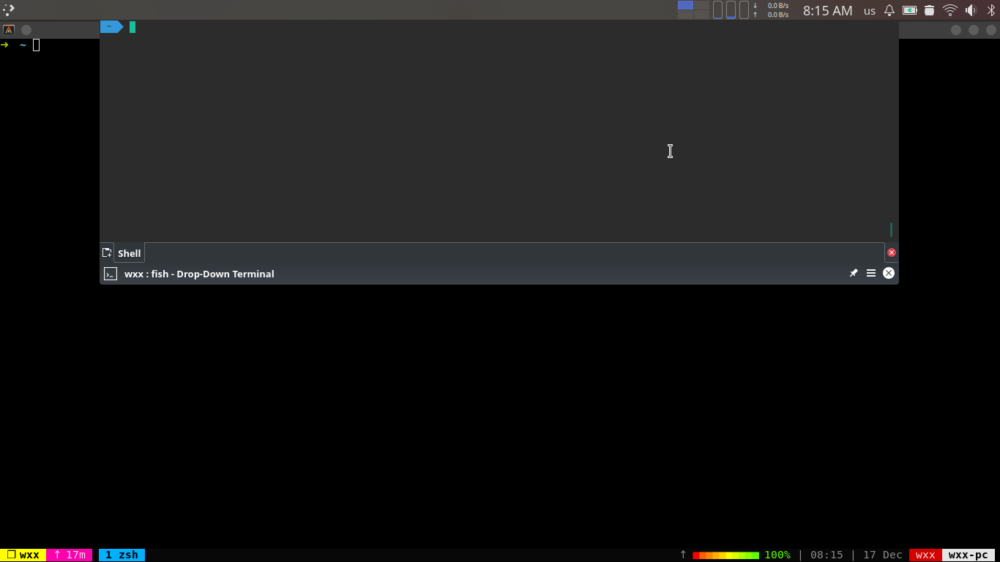

# WXX's dotfiles

# My work environment

## OS

manjaro+kde

## terminal emulator and shell

 - alacritty + oh-my-fish
 - yakuake + oh-my-zsh (powerboot)

zsh + oh-my-zsh

## tmux

oh-my-tmux

### input method

ibus-rime

## text editor

 - spacevim
 - spacemacs  = emacs + vim

